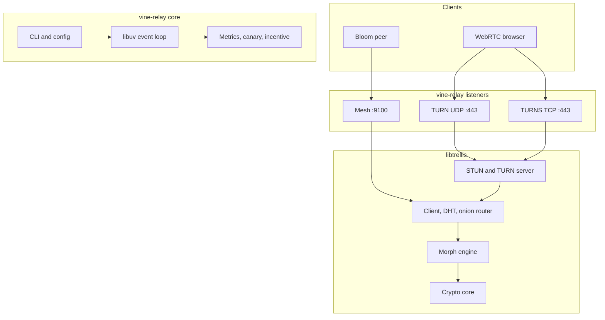

<div align="center">


# vine-relay

**Post-quantum Bloom relay node and drop-in coturn replacement — in portable C11.**


</div>

---

`vine-relay` is the reference relay daemon for the [Bloom Protocol](https://bloomprotocol.org). It is a single C11 binary built on [`libtrellis`](../../libtrellis/README.md) that does two things at once: it participates in the Bloom mesh as a Kademlia DHT node, onion router, greenhouse introduction point, and exit relay, and it also ships a built-in **STUN / TURN server** that is wire-compatible with coturn's `use-auth-secret` scheme. Running both on the same process lets WebRTC media traverse the same post-quantum, censorship-resistant fabric as the rest of Bloom, without pulling in a second daemon.

## Contents

- [Highlights](#highlights)
- [Architecture](#architecture)
- [Quick start](#quick-start)
- [Minimal example](#minimal-example)
- [Prerequisites](#prerequisites)
- [Building](#building)
- [Running](#running)
- [TURN server (coturn replacement)](#turn-server-coturn-replacement)
- [CLI reference](#cli-reference)
- [Config file](#config-file)
- [Production deployment](#production-deployment)
- [NeverCast integration](#nevercast-integration)
- [Migration from coturn](#migration-from-coturn)
- [Censorship resistance](#censorship-resistance)
- [Testing](#testing)
- [Repository layout](#repository-layout)
- [Implementation status](#implementation-status)
- [Security](#security)
- [License](#license)

## Highlights

- **Hybrid post-quantum identity** — every relay has a composite Ed25519 + ML-DSA-87 + X25519 + ML-KEM-1024 + SLH-DSA-256s identity, persisted on disk and advertised in the DHT via a signed relay descriptor.
- **Onion-routed mesh** — Kademlia DHT, three-hop hybrid-KEM circuits, guard pinning, signed bandwidth receipts, warrant canary.
- **Built-in STUN + TURN** — RFC 5389 binding and RFC 5766 allocate / refresh / create-permission / channel-bind / channel-data, authenticated with the same HMAC-SHA1 `use-auth-secret` scheme as coturn, so no client changes are needed.
- **UDP and TLS on a single port** — the TURN listener binds UDP *and* TCP/TLS on the same address (typically `:443`); the browser's ICE agent tries UDP first and transparently falls back to TURNS on the same port.
- **Session-keyed relay fast-path** — media traffic uses a 64-byte session envelope (circuit id + fingerprint + AES-GCM nonce and tag) instead of a full hybrid-signed onion cell, keeping overhead near coturn on the hot path.
- **Traffic morphology** — constant-rate padding, timing jitter, metamorphic encoding, cover traffic, decoy circuits, and wire camouflage (TLS 1.3, HTTP/2, DNS, QUIC, raw-obfs).
- **Pluggable transports** — obfs4, snowflake, and webtunnel via a subprocess PT binary, on both the mesh and the TURN port.
- **Greenhouse + exit relay** — optional introduction-point role, optional SOCKS5 + DoH exit with per-rule policies, jurisdiction exclusion.
- **Lightning-settled bandwidth** — Ed25519-signed receipts, optionally redeemable through BTCPay + `lncli` when `TRELLIS_WITH_LIGHTNING` is enabled.
- **Operations-ready** — config file or CLI, `--dump-config`, `--daemon` + `--pidfile`, Prometheus metrics endpoint, log-level control, systemd friendly.

## Architecture



The daemon runs two event loops. The **client loop** (background thread) owns every I/O object: TCP / TLS / PT listeners, the Kademlia DHT, onion circuit management, gossip, the morph engine, cover traffic, the greenhouse introduction point, and the TURN TCP / UDP listeners and their tick timer. The **main loop** (foreground) handles OS signals (SIGINT / SIGTERM for shutdown, SIGHUP for log rotation) and periodic metrics sync. The TURN listeners and tick timer are scheduled onto the client loop via `uv_async_send` at startup for thread-safety.

## Quick start

```bash
# Dependencies (libsodium, libuv, build toolchain)
sudo apt install -y build-essential cmake pkg-config libsodium-dev libuv1-dev python3

# Build vine-relay from this directory (also builds libtrellis and its vendored deps)
python3 build.py

# Run (identity file is generated on first start)
./vine-relay --listen 0.0.0.0:9100 --identity relay.json
```

On startup the relay logs its fingerprint, ML-KEM public key, and a ready-to-paste `BLOOM_RELAY_SEEDS` entry you can drop into another relay or into NeverCast's environment.

## Minimal example

```
$ ./vine-relay --listen 127.0.0.1:9100 --identity /tmp/relay.json
... vine-relay started (trellis 0.1.0)
... listening on 127.0.0.1:9100
... fingerprint: 3a7f…c1
... mlkem-pk: 8b02…09
... BLOOM_RELAY_SEEDS entry: 3a7f…c1@127.0.0.1:9100|8b02…09
```

Link it into a running mesh by passing `--seed <addr>` for each known peer (up to 8 seeds). Kademlia discovers the rest.

## Prerequisites

| Package | Install |
|---------|---------|
| CMake 3.20+ | `sudo apt install cmake` |
| C11 compiler | `sudo apt install build-essential` |
| libsodium >= 1.0.18 | `sudo apt install libsodium-dev` |
| libuv >= 1.x | `sudo apt install libuv1-dev` |
| pkg-config | `sudo apt install pkg-config` |
| Python 3.6+ | for `build.py` and helper scripts |

One-liner:

```bash
sudo apt install -y build-essential cmake pkg-config libsodium-dev libuv1-dev python3
```

Every other dependency (liboqs, mbedTLS, msgpack-c, tinycbor) is fetched, pinned, and built by the CMake tree — you do not need to install them.

## Building

### With `build.py` (recommended)

```bash
python3 build.py              # Release build, copies binary to ./vine-relay
python3 build.py --debug      # Debug build
python3 build.py --clean      # Delete the CMake build tree first
python3 build.py --jobs 4     # Limit parallel compilation jobs
python3 build.py --build-dir /path/to/build  # Override build directory
```

The script configures the top-level Trellis CMake project with `-DTRELLIS_BUILD_STATIC=ON -DTRELLIS_BUILD_TESTS=OFF -DTRELLIS_WITH_LIGHTNING=ON`, builds the `vine-relay` target, and copies the resulting binary next to this README.

### Manual build

```bash
cd ../..                            # trellis/ project root
cmake -B build -S . \
  -DCMAKE_BUILD_TYPE=Release \
  -DTRELLIS_BUILD_STATIC=ON \
  -DTRELLIS_BUILD_TESTS=OFF \
  -DTRELLIS_WITH_LIGHTNING=ON
cmake --build build --target vine-relay -j"$(nproc)"

# Binary: build/apps/vine-relay/vine-relay
```

`TRELLIS_WITH_LIGHTNING=ON` compiles the receipt-redemption path; without it, Ed25519-signed receipts are still tracked but cannot be settled over Lightning. See [libtrellis CMake options](../../libtrellis/README.md#cmake-options) for the full set of feature flags.

## Running

### Basic

```bash
./vine-relay \
    --listen 0.0.0.0:9100 \
    --identity /var/lib/vine-relay/identity.json
```

The identity file is created on first run and contains the relay's composite key material (Ed25519, X25519, ML-KEM-1024, ML-DSA-87). Keep it safe — deleting it gives the relay a fresh fingerprint and resets its reputation in the mesh.

### Joining an existing mesh

```bash
./vine-relay \
    --listen 0.0.0.0:9100 \
    --identity relay.json \
    --seed relay1.example.com:9100 \
    --seed relay2.example.com:9100
```

Up to 8 seeds may be supplied. The Kademlia DHT fans out to additional peers automatically once it has at least one good contact.

### Local development (multiple relays on localhost)

```bash
# Terminal 1 — Relay A (no seeds needed)
./vine-relay --listen 127.0.0.1:9100 --identity /tmp/relay-a.json

# Terminal 2 — Relay B (seeds to A)
./vine-relay --listen 127.0.0.1:9101 --identity /tmp/relay-b.json --seed 127.0.0.1:9100

# Terminal 3 — Relay C (seeds to A)
./vine-relay --listen 127.0.0.1:9102 --identity /tmp/relay-c.json --seed 127.0.0.1:9100
```

Each relay prints a `BLOOM_RELAY_SEEDS entry: <fp>@<addr>|<mlkem-pk>` line. Paste those into a NeverCast `.env`:

```
BLOOM_RELAY_SEEDS=<fpA>@127.0.0.1:9100|<mlkemA>,<fpB>@127.0.0.1:9101|<mlkemB>,<fpC>@127.0.0.1:9102|<mlkemC>
```

Then run `npm run dev:bloom` from the NeverCast `app/` directory. The service node's relay bridge connects to these relays and onion-routed messages transit through the local mesh.

## TURN server (coturn replacement)

vine-relay includes a built-in STUN / TURN server that replaces coturn for WebRTC NAT traversal. It implements the subset of STUN / TURN that browsers actually use:

- **STUN** (RFC 5389): Binding Request / Response with `XOR-MAPPED-ADDRESS`.
- **TURN** (RFC 5766): Allocate, Refresh, CreatePermission, ChannelBind, Send / Data indications, ChannelData relay.

Authentication uses the **HMAC-SHA1 `use-auth-secret`** scheme exactly as coturn does, so credentials generated for coturn work unmodified against vine-relay — no client-side changes.

### Why replace coturn

| | coturn | vine-relay |
|---|--------|------------|
| Protocol | STUN / TURN only | STUN / TURN + Bloom mesh |
| Encryption | TLS transport only | Post-quantum (ML-KEM-1024 + X25519) |
| Routing | Direct relay | Adaptive: 1-hop for media, 3-hop onion for signaling |
| Ports | 3478 (TURN), 5349 (TURNS), 443 | UDP + TCP/443 on a single port |
| Privacy | Server sees all peer IPs | Session-keyed relay with AES-256-GCM |
| Censorship resistance | None | Domain fronting, ECH, pluggable transports |

### Enabling TURN

```bash
./vine-relay \
    --listen 0.0.0.0:9100 \
    --identity relay.json \
    --turn \
    --turn-listen 0.0.0.0:443 \
    --turn-secret "your-shared-secret" \
    --turn-realm neverroute.com \
    --turn-cert /etc/letsencrypt/live/relay.example.com/fullchain.pem \
    --turn-key /etc/letsencrypt/live/relay.example.com/privkey.pem \
    --routing adaptive
```

The TURN server listens on both **UDP and TCP** on the same port (default 443). WebRTC clients try UDP first (lower-latency media relay) and fall back to TCP + TLS (TURNS) if UDP is blocked. The signaling server returns both `turn:relay.example.com:443` (UDP) and `turns:relay.example.com:443` (TCP + TLS), so the browser's ICE agent picks the best transport automatically.

### Privacy modes (`--turn-privacy`)

| Mode | Hops | Use case |
|------|------|----------|
| `speed` | 1-hop session-keyed relay | Media / video — lowest latency |
| `balanced` | 1-hop for media, 3-hop for signaling | Default recommendation |
| `max` | 3-hop onion for everything | Maximum privacy, higher latency |

With `--routing adaptive`, vine-relay automatically selects the hop count based on the privacy mode and the type of traffic being relayed.

### Session-keyed relay

For media traffic (audio / video RTP), vine-relay uses a session-keyed relay mode that avoids full onion-routing overhead:

1. Client sends `CIRCUIT_CREATE_SESSION` with an ML-KEM encapsulation.
2. Relay decapsulates to derive a shared AES-256-GCM session key.
3. Subsequent media packets (`SESSION_DATA`) are encrypted with just the session key — 64 bytes of envelope per packet instead of ~6 KB for a full hybrid-signed onion cell.

The 64-byte envelope is: `circuit_id` (4) + destination fingerprint (32) + AES-GCM nonce (12) + authentication tag (16).

### Bandwidth overhead vs coturn

| Layer | Per-packet overhead |
|-------|---------------------|
| coturn (ChannelData) | +4 bytes |
| vine-relay (session-keyed, `speed` mode) | +64 bytes (~5% for 1200 B packets) |
| vine-relay (full hybrid signing) | +~4.8 KB (~400% — only for signaling) |
| vine-relay (Ed25519-only signing) | +~216 bytes (~18%) |

For media, the session-keyed mode keeps overhead under 5% compared to coturn.

## CLI reference

The authoritative source is `./vine-relay --help`, which is generated from [`src/config.c`](src/config.c). The table below mirrors it.

```
vine-relay [OPTIONS]

Network:
  -l, --listen <addr>              Listen address (default: 0.0.0.0:9100)
  -i, --identity <path>            Identity key file (created if missing)
      --seed <addr>                Bootstrap seed (repeatable, max 8)
      --discover / --no-discover   LAN discovery (default: off)

Transport:
      --transport <tcp|tls|pt>     Transport mode (default: tcp; `raw` is an alias for tcp)
      --camouflage <type>          none|tls13|http2|dns|quic|raw-obfs (default: raw-obfs)
      --morph / --no-morph         Metamorphic encoding (default: off)
      --verify-peer / --no-verify-peer   TLS peer certificate verification (default: off)

Pluggable transports:
      --pt-binary <path>           Path to PT binary (e.g. obfs4proxy)
      --pt-transport <name>        Protocol name (obfs4|snowflake|webtunnel)
      --pt-args <args>             Extra PT arguments

Routing:
      --routing <mode>             direct|relay|multipath|onion|auto|adaptive
      --guard / --no-guard         Pin entry guards (default: off)
      --guard-persist <path>       Guard state file (default: auto)
      --cell-mode / --no-cell-mode Fixed-size cell fragmentation (default: off)
      --cell-size <bytes>          Cell size (default: 512)

Privacy:
      --cover-traffic <ms>         Cover traffic interval (0 = off)
      --decoy-interval <ms>        Decoy circuit interval (0 = off)
      --always-on / --no-always-on Keep running when idle (default: on)
      --exclude-jurisdiction <CC>  Exclude ISO country code (comma-separated, repeatable)
      --no-eclipse                 Disable eclipse attack detection (local testing)
      --no-sybil                   Disable all Sybil defenses (local testing)

Security:
      --pow-iters <n>              Per-connection proof-of-work iterations

Services:
      --intro-point / --no-intro-point   Serve as greenhouse introduction point
      --exit-relay / --no-exit-relay     Enable clearnet exit relay
      --exit-policy <rule>         Exit policy (repeatable, e.g. allow:*:443)
      --exit-socks5-port <port>    Local SOCKS5 proxy port (0 = off)

Incentive:
      --btcpay-url <url>           BTCPay Server URL for receipt redemption
      --btcpay-key <key>           BTCPay API key
      --lncli-path <path>          Path to lncli (default: lncli)
      --sats-per-mb <n>            Payment rate in sats per MB (default: 1)

TURN relay:
      --turn                       Enable TURN relay server
      --turn-listen <addr>         TURN listen address (default: 0.0.0.0:443)
      --turn-secret <secret>       HMAC-SHA1 shared secret
      --turn-realm <realm>         TURN realm (e.g. neverroute.com)
      --turn-cert <path>           TLS certificate for TURNS
      --turn-key <path>            TLS private key for TURNS
      --turn-max-alloc <n>         Max TURN allocations (default: 200)
      --turn-max-bps <n>           Per-allocation bandwidth cap in bytes/s
      --turn-transport <modes>     Comma-separated; currently `tls` (default)
      --turn-privacy <mode>        speed|balanced|max (default: speed)
      --turn-external-ip <ip>      Public IP for relay address (auto-detected if omitted)
      --turn-front-host <host>     Domain fronting CDN host
      --turn-relay-target <addr>   Domain fronting relay target
      --turn-ech-public-name <sni> ECH outer public name
      --turn-pt-binary <path>      Pluggable transport binary for TURN
      --turn-pt-transport <name>   PT protocol for TURN clients

Monitoring:
      --metrics-port <port>        Prometheus endpoint (default: 9101, 0 = off)
      --canary / --no-canary       Warrant canary publishing (default: on)
      --canary-statement <text>    Custom canary attestation

Logging:
      --log-level <level>          debug|info|warn|error (default: info)
      --log-file <path>            Log to file instead of stderr

Daemon:
      --daemon                     Fork to background (requires --log-file)
      --pidfile <path>             Write PID file

Other:
      --config <path>              Load a key=value config file
      --dump-config                Print the resolved config and exit
  -V, --version                    Print version and exit
  -h, --help                       Show help
```

CLI arguments always override config-file values.

## Config file

vine-relay accepts a simple `key = value` config file (comments begin with `#`; `[section]` headers are allowed but ignored). Keys use `snake_case` — exactly the keys produced by `--dump-config`.

```ini
# /etc/vine-relay/config.conf

# Network
listen          = 0.0.0.0:9100
identity        = /var/lib/vine-relay/identity.json
seed            = relay1.example.com:9100
seed            = relay2.example.com:9100

# Transport & routing
transport       = tcp
camouflage      = raw-obfs
routing         = adaptive

# Privacy
cover_traffic   = 5000
guard           = true

# Monitoring
metrics_port    = 9101
log_level       = info
log_file        = /var/log/vine-relay.log

# Incentive (relay earns Lightning for bandwidth served)
btcpay_url      = https://btcpay.yourdomain.com
btcpay_key      = your-btcpay-api-key
lncli_path      = /usr/bin/lncli
sats_per_mb     = 1

# TURN server
turn            = true
turn_listen     = 0.0.0.0:443
turn_secret     = your-shared-secret
turn_realm      = neverroute.com
turn_cert       = /etc/letsencrypt/live/relay.example.com/fullchain.pem
turn_key        = /etc/letsencrypt/live/relay.example.com/privkey.pem
turn_privacy    = speed
```

```bash
./vine-relay --config /etc/vine-relay/config.conf
```

Use `./vine-relay --config /etc/vine-relay/config.conf --dump-config` to see the resolved configuration in the same file format.

## Production deployment

### Recommended layout (TURN + mesh relay on one host)

```bash
./vine-relay \
    --listen 0.0.0.0:9100 \
    --identity /var/lib/vine-relay/identity.json \
    --seed relay1.example.com:9100 \
    --turn \
    --turn-listen 0.0.0.0:443 \
    --turn-secret "$(cat /etc/vine-relay/turn-secret)" \
    --turn-realm neverroute.com \
    --turn-cert /etc/letsencrypt/live/relay.example.com/fullchain.pem \
    --turn-key /etc/letsencrypt/live/relay.example.com/privkey.pem \
    --turn-privacy speed \
    --routing adaptive \
    --guard \
    --cover-traffic 5000 \
    --metrics-port 9101 \
    --log-level info \
    --log-file /var/log/vine-relay.log
```

### systemd service

```ini
[Unit]
Description=vine-relay (Bloom Protocol relay node + TURN server)
After=network-online.target
Wants=network-online.target

[Service]
Type=simple
User=vine-relay
Group=vine-relay
ExecStart=/usr/local/bin/vine-relay --config /etc/vine-relay/config.conf
Restart=on-failure
RestartSec=5
LimitNOFILE=65536
ProtectSystem=strict
ProtectHome=true
ReadWritePaths=/var/lib/vine-relay /var/log
NoNewPrivileges=true
AmbientCapabilities=CAP_NET_BIND_SERVICE
CapabilityBoundingSet=CAP_NET_BIND_SERVICE

[Install]
WantedBy=multi-user.target
```

`CAP_NET_BIND_SERVICE` is required to bind port 443 without running as root.

```bash
sudo cp vine-relay /usr/local/bin/
sudo useradd -r -s /usr/sbin/nologin vine-relay
sudo mkdir -p /var/lib/vine-relay /etc/vine-relay
sudo chown vine-relay:vine-relay /var/lib/vine-relay
sudo cp vine-relay.service /etc/systemd/system/
sudo systemctl enable --now vine-relay
```

### TLS certificate

vine-relay needs a valid TLS certificate for TURNS on port 443. Let's Encrypt with certbot:

```bash
sudo certbot certonly --standalone -d relay.yourdomain.com

# Certificate: /etc/letsencrypt/live/relay.yourdomain.com/fullchain.pem
# Private key: /etc/letsencrypt/live/relay.yourdomain.com/privkey.pem
```

Auto-renewal hook:

```bash
# /etc/letsencrypt/renewal-hooks/deploy/vine-relay.sh
#!/bin/bash
systemctl restart vine-relay
```

### Firewall

```bash
sudo ufw allow 443/tcp  comment "vine-relay TURNS (TCP+TLS)"
sudo ufw allow 443/udp  comment "vine-relay TURN (UDP)"
sudo ufw allow 9100/tcp comment "vine-relay mesh"
# Optional: expose Prometheus metrics (restrict to localhost or a monitoring subnet)
# sudo ufw allow 9101/tcp comment "vine-relay metrics"
```

### DNS

```
relay.yourdomain.com.  A     203.0.113.10
relay.yourdomain.com.  AAAA  2001:db8::10
```

### Shared secret

Use the same secret for both vine-relay and NeverCast:

```bash
openssl rand -hex 64 | sudo tee /etc/vine-relay/turn-secret
```

Then set `--turn-secret "$(cat /etc/vine-relay/turn-secret)"` on vine-relay and `VINE_RELAY_SECRET=<same value>` in NeverCast's `app/.env`.

## NeverCast integration

### End-to-end flow

When a NeverCast user joins a room:

```
Browser                  NeverCast server             vine-relay
  │                           │                           │
  │  GET /turn-credentials    │                           │
  │ ─────────────────────────>│                           │
  │                           │  (generates HMAC-SHA1     │
  │                           │   credentials, returns    │
  │                           │   turns:relay:443 URLs)   │
  │  { iceServers: [...] }    │                           │
  │ <─────────────────────────│                           │
  │                           │                           │
  │  TLS connect :443         │                           │
  │ ──────────────────────────┼──────────────────────────>│
  │                           │                           │
  │  STUN Binding             │                           │
  │ ──────────────────────────┼──────────────────────────>│
  │  Binding Response         │                           │
  │ <─────────────────────────┼───────────────────────────│
  │                           │                           │
  │  Allocate (unauth)        │                           │
  │ ──────────────────────────┼──────────────────────────>│
  │  401 + nonce + realm      │                           │
  │ <─────────────────────────┼───────────────────────────│
  │                           │                           │
  │  Allocate (authenticated) │                           │
  │ ──────────────────────────┼──────────────────────────>│
  │  Success + relay address  │                           │
  │ <─────────────────────────┼───────────────────────────│
  │                           │                           │
  │  CreatePermission         │                           │
  │  ChannelBind              │                           │
  │  ChannelData (media) ────────────────────────────────>│
  │                           │                     ChannelData (media)
  │                           │                     ──────> other peer
```

1. **Credential fetch** — the browser asks the NeverCast app server for TURN credentials. The server generates time-limited HMAC-SHA1 credentials (coturn's `use-auth-secret` scheme).
2. **ICE negotiation** — the browser tries UDP first (`turn:relay:443`). If UDP is blocked, it falls back to TCP + TLS (`turns:relay:443`). In both cases: STUN Binding, then the TURN Allocate handshake (401 challenge → authenticated Allocate).
3. **Permission and channel setup** — the browser creates permissions and binds channels for the remote peer's relay address.
4. **Media relay** — audio / video RTP flows as ChannelData frames. Over UDP this avoids TCP head-of-line blocking for better real-time performance. vine-relay forwards frames to the destination peer, either locally (both peers on the same relay) or through the Bloom mesh (multi-relay).
5. **ICE escalation** — if the initial connection fails, the NeverCast client automatically escalates through three attempts:
   - All ICE servers, `iceTransportPolicy: 'all'` (P2P preferred).
   - Prioritize `turn:443` (UDP) and `turns:443` (TCP + TLS).
   - Force relay only with `iceTransportPolicy: 'relay'` (all traffic through vine-relay, bypasses most firewalls).

### Configuring NeverCast

In `app/.env`:

```bash
# Replace coturn entirely
VINE_RELAY_DOMAIN=relay.yourdomain.com
VINE_RELAY_SECRET=your-shared-secret-here

# Optional: adjust credential TTL (default: 86400 = 24 hours)
VINE_RELAY_TTL=86400
```

The signaling server returns both `turn:relay.yourdomain.com:443` (UDP) and `turns:relay.yourdomain.com:443` (TCP + TLS) as TURN URLs. No ports 3478 or 5349 — everything runs through 443. `VINE_RELAY_SECRET` must match the `--turn-secret` passed to vine-relay.

### Relay bridge (Bloom mesh)

Separately from TURN, the NeverCast server joins the vine-relay mesh through the relay bridge (`app/server/bloom/relay-bridge.ts`). When `VINE_RELAY_DOMAIN` is set, the bridge switches routing mode from `onion` to `adaptive` — signaling messages use 3-hop onion routing for privacy, and media uses 1-hop session-keyed relay for latency.

Configure mesh seeds:

```bash
BLOOM_RELAY_SEEDS=<fingerprint>@relay.yourdomain.com:9100|<mlkem-pk>
```

## Migration from coturn

### 1. Deploy vine-relay alongside coturn

Run vine-relay on port 443 with the same shared secret as coturn, and enable canary mode in NeverCast:

```bash
# app/.env
VINE_RELAY_DOMAIN=relay.yourdomain.com
VINE_RELAY_SECRET=your-existing-turn-secret   # MUST match TURN_SECRET
VINE_RELAY_CANARY=true
TURN_SECRET=your-existing-turn-secret
TURN_DOMAIN=turn.yourdomain.com
```

In canary mode the signaling server returns **both** vine-relay and coturn URLs in the ICE servers list; the browser's ICE agent picks the best path automatically.

> `VINE_RELAY_SECRET` and `TURN_SECRET` **must be identical** in canary mode because one set of credentials is generated and sent to both servers. NeverCast logs a warning at startup if they differ.

### 2. Monitor

```bash
journalctl -u vine-relay -f
# Look for: "TURN server listening on ..."
# Look for: allocation success messages in debug mode
```

### 3. Cut over

```bash
# app/.env — remove canary mode
VINE_RELAY_DOMAIN=relay.yourdomain.com
VINE_RELAY_SECRET=your-shared-secret
# Remove VINE_RELAY_CANARY, TURN_SECRET, TURN_DOMAIN
```

### 4. Decommission coturn

```bash
sudo systemctl stop coturn
sudo systemctl disable coturn
```

## Censorship resistance

### Domain fronting (`--turn-front-host` / `--turn-relay-target`)

Route TURN traffic through a CDN so the true relay destination is hidden from network observers:

```bash
--turn-front-host cdn.example.com \
--turn-relay-target relay.yourdomain.com
```

### Encrypted Client Hello (`--turn-ech-public-name`)

Encrypt the SNI in the TLS ClientHello so middleboxes cannot see which host the client is connecting to:

```bash
--turn-ech-public-name public.example.com
```

### Pluggable transports (`--turn-pt-binary` / `--turn-pt-transport`)

Wrap TURN traffic in an obfuscation layer (obfs4, snowflake, webtunnel):

```bash
--turn-pt-binary /usr/bin/obfs4proxy \
--turn-pt-transport obfs4
```

The same `--pt-*` flags apply to the mesh port; they can be combined.

## Testing

The vine-relay repo contains a config-parsing unit test; the TURN protocol is covered by libtrellis unit tests and a Python end-to-end harness.

**Config parser (CTest)** — builds with the libtrellis test suite (`-DTRELLIS_BUILD_TESTS=ON`):

```bash
cd ../..                              # trellis/ project root
cmake -B build -S . -DTRELLIS_BUILD_TESTS=ON
cmake --build build --target test_vine_config -j"$(nproc)"
ctest --test-dir build -R test_vine_config --output-on-failure
```

**TURN unit tests (CTest)** — 26 tests covering STUN / TURN detection, parsing, integrity, and server operations:

```bash
cmake --build build --target test_turn -j"$(nproc)"
./build/libtrellis/test_turn
```

**End-to-end TURN test (Python)** — exercises the full TURN protocol over both TCP and UDP against a live vine-relay:

```bash
# Start vine-relay with TURN enabled
./vine-relay --turn --turn-listen 0.0.0.0:13488 \
    --turn-secret test-secret --turn-realm test.local \
    --listen 0.0.0.0:14000 --routing adaptive &

# TCP
python3 ../../libtrellis/tests/test_turn_e2e.py 127.0.0.1 13488 test-secret

# UDP
python3 ../../libtrellis/tests/test_turn_e2e.py 127.0.0.1 13488 test-secret --udp
```

The e2e test verifies, for each transport: STUN Binding → response with `XOR-MAPPED-ADDRESS`; Allocate (unauth) → 401 with nonce and realm; Allocate (authenticated) → success with relay address and lifetime; CreatePermission; Send Indication; ChannelBind; ChannelData forwarded; Refresh keep-alive; Refresh with lifetime=0 deallocates.

**Full suite** — every libtrellis test, including TURN integration:

```bash
ctest --test-dir build --output-on-failure
```

**Benchmarks** — available with `-DTRELLIS_BUILD_BENCHMARKS=ON`:

```bash
cmake -B build-bench -S . -DTRELLIS_BUILD_BENCHMARKS=ON
cmake --build build-bench --target bench_turn -j"$(nproc)"
./build-bench/libtrellis/bench_turn
```

## Repository layout

```
apps/vine-relay/
├── src/
│   ├── main.c             Relay state, event loops, TURN listeners, DTLS peer registry
│   ├── config.c / .h      CLI + config file parsing, defaults, --dump-config
│   └── log.c / .h         Leveled logger (debug/info/warn/error)
├── tests/
│   └── test_vine_config.c CTest unit tests for config parsing (wired in libtrellis/CMakeLists.txt)
├── .assets/
│   └── logo.svg           Bloom logo used in this README
├── CMakeLists.txt         `vine-relay` target definition
├── build.py               Wrapper that builds the Trellis tree and copies the binary here
└── clear-ports.py         Dev helper: kill processes on relay ports 9100-9404
```

## Implementation status

> **Why this table exists.** The Bloom whitepaper describes the full target
> architecture. vine-relay inherits every subsystem from libtrellis, and not
> every described capability is fully deployed in the current build. This
> section maps what vine-relay actually runs today. If you are making security
> claims based on vine-relay, reference this table — not the whitepaper alone —
> and consult the full per-file breakdown in the
> [libtrellis Implementation Status](../../libtrellis/README.md#implementation-status).

Status labels (same vocabulary as libtrellis):

- **Complete** — fully implemented and tested
- **Complete (flag)** — fully implemented, but requires an optional CMake flag to compile
- **Partial** — implemented with known limitations (see notes)
- **Stub** — API surface exists; implementation is a no-op or always-pass placeholder
- **Removed** — described in the spec but removed from the production build

### What vine-relay ships today

| Area | Status | Detail |
|------|--------|--------|
| Hybrid PQ handshake | Complete | X25519 + ML-KEM-1024 with dual Ed25519 + ML-DSA-87 signatures |
| PQ ratchet + TreeKEM | Complete | Per-session keys and RFC 9420-style group-key tree |
| Kademlia DHT | Complete | Peer discovery, value storage, signed relay descriptors |
| Onion routing (3-hop) | Complete | Hybrid-KEM per-hop, multi-layer AES-GCM |
| Session-keyed relay (1-hop) | Complete | Low-overhead media relay path |
| STUN / TURN | Complete | RFC 5389 + RFC 5766, HMAC-SHA1 auth, UDP + TCP / TLS on one port |
| Traffic shaping | Complete | Constant-rate padding, timing jitter, metamorphic encoding |
| Wire camouflage | Complete | TLS 1.3 / HTTP/2 / DNS / QUIC / raw-obfs mimicry |
| Pluggable transports | Complete | obfs4, snowflake, webtunnel via `--pt-binary` (mesh) and `--turn-pt-binary` (TURN) |
| Guard pinning | Complete | Sybil-resistant entry-guard selection (`--guard`) |
| Cover traffic + decoy circuits | Complete | Configurable intervals (`--cover-traffic`, `--decoy-interval`) |
| Exit relay | Complete | SOCKS5 + DoH, per-rule exit policies, jurisdiction exclusion |
| Relay incentive (bandwidth receipts) | Complete | Ed25519-signed receipts |
| Lightning settlement | Complete (flag) | Requires `TRELLIS_WITH_LIGHTNING` at build time and `lncli` at runtime |
| Warrant canary | Complete | Published through gossip; `--canary-statement` customizes the attestation |
| Greenhouse introduction point | Complete | Optional role via `--intro-point` |
| Metrics endpoint | Complete | Prometheus scrape endpoint on `--metrics-port` (default 9101) |
| Config file + CLI | Complete | Key = value format, `--dump-config`, CLI overrides file values |
| Daemon mode | Complete | `--daemon` + `--pidfile`; requires `--log-file` |

### Known gaps and caveats

| Area | Status | Detail |
|------|--------|--------|
| Morph disguise codecs | Removed | Described in the whitepaper; removed from the production C core. Only traffic shaping (padding, timing, metamorphic encoding) is active |
| HCO (Human Challenge Oracle) | Stub | `trellis_hco_verify` always returns OK; `trellis_hco_freshness` always returns 1.0. Enabling `TRELLIS_WITH_HCO` fails compilation — no real implementation exists yet |
| Rhizome federation | Partial | Grove, bridge, and canopy components are implemented and unit-tested; cross-grove federation has not been deployed or validated at production scale |
| Greenhouse service lifecycle | Partial | Onion primitives, descriptors, and intro points work; full end-to-end service flow has caveats and has not been validated at scale |
| QUIC transport | Off by default | Requires `TRELLIS_WITH_QUIC` + quictls at build time |
| BLE transport | Partial (flag) | Requires `TRELLIS_WITH_DTN`. Framing and DTN queue work; BlueZ D-Bus integration is limited (hardcoded GATT paths, no persistent server) |
| LoRa transport | Complete (flag) | Requires `TRELLIS_WITH_DTN`. Serial AT commands, on-disk DTN bundles, chunking |
| WebRTC steganographic transport | Partial (flag) | Requires `TRELLIS_WITH_WEBRTC_STEGO`. Outbound LSB stego + Opus works; inbound signaling and RS-FEC decode path incomplete |
| TURN transport modes (`--turn-transport`) | Partial | Flag accepts a comma list (e.g. `tls,quic`); only `tls` is wired end-to-end today |
| Mobile SDK DHT peer limits | Partial | Limits described in the libtrellis header are not enforced in code |

> This table should be updated whenever a subsystem's status changes. If you
> are making or evaluating security claims about Bloom, check this table first.

## Security

vine-relay is a security-critical daemon. It has not yet undergone an independent audit; until it has, treat all deployments as experimental and keep the blast radius of an individual relay small (dedicated Unix user, `CAP_NET_BIND_SERVICE` only, read-write paths restricted via systemd).

The mesh layers vine-relay exposes include multiple Sybil defenses inherited from libtrellis:

- **VDF proof-of-work** for new-node admission.
- **Behavioral anomaly scoring** for detecting malicious patterns.
- **Trust graph** with vouch chains.
- **AS-diverse hop selection** to prevent single-AS circuit captures.
- **Guard pinning** (`--guard`) to resist Sybil-based predecessor attacks.
- **Eclipse-attack detection** through canary DHT keys (disable with `--no-eclipse` only for local testing).

If you believe you have found a vulnerability, **do not** open a public issue. Email the maintainers directly or follow the disclosure process documented in the top-level Bloom repository. Coordinated disclosure is welcome and appreciated.

Fuzz harnesses (see [libtrellis fuzzing](../../libtrellis/README.md#testing-fuzzing-benchmarks)) are expected to run clean under libFuzzer + ASan + UBSan before any release tag.

## License

vine-relay and all Bloom-related code in this repository are Copyright (c) 2024-2026 cRash, licensed under the **GNU Lesser General Public License v3.0 with the additional terms** in [LICENSE](../../LICENSE). See [NOTICE](../../NOTICE) for component attribution.
